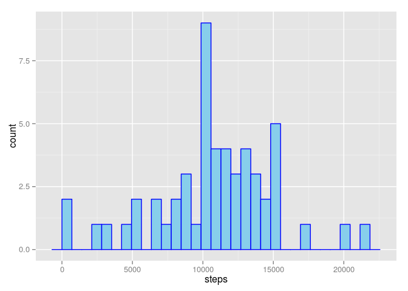

# Reproducible Research: Peer Assessment 1
Sarah Susanne Thiesen  
28.02.2016  

## Overview

In this assignment i have analyzed data from a personal actvity monitoring device. The data was collected from an anonymous individual and includes the steps taken in 5 minute invervals each day for two months. After loading the data, i have calculated the mean number of steps taken per day, analyzed the average daily activity pattern, imputed missing values, and calculated the difference in activity between weekdays and the weekend.

## Loading and preprocessing the data


```r
unzip("/home/sarah/Dropbox/Uni/Coursera/R/activity.zip")
activity <- read.csv("/home/sarah/Dropbox/Uni/Coursera/R/activity.csv")
```

## What is mean total number of steps taken per day?

Here I've calculted the total number of steps taken each day and visualized the results in a histogram:


```r
library(dplyr)
activity_naomit <- na.omit(activity)
stepsPerDay <- summarize(group_by(activity_naomit, date), steps = sum(steps, na.rm = TRUE))

library(ggplot2)
h <- ggplot(stepsPerDay, aes(steps))
h + geom_histogram(col = "blue", fill = "skyblue")
```

 

The mean and median number of steps taken per day are as follows:


```r
data.frame(Value = c(round(mean(stepsPerDay$steps), digits = 2), 
                     median(stepsPerDay$steps)), row.names = c("Mean", "Median"))
```

```
##           Value
## Mean   10766.19
## Median 10765.00
```

## What is the average daily activity pattern?

Next I've calculated the average number of steps taken during each 5-minute interval and visualized the results in a time series plot.


```r
byInterval <- summarize(group_by(activity_naomit, interval), steps = mean(steps, na.rm = TRUE))
i <- ggplot(byInterval, aes(interval, steps))
i + geom_line()
```

 

The interval that contains the highest number of steps (on average) is the following:


```r
filter(byInterval, steps == max(steps))
```

```
## Source: local data frame [1 x 2]
## 
##   interval    steps
## 1      835 206.1698
```

## Imputing missing values

The dataset contains ``2304`` missing values.


```r
sum(is.na(activity$steps))
```

```
## [1] 2304
```

To fill in the missing values I've used the average number of steps for the 5-minute interval.


```r
activity2 <- activity
for(i in 1:nrow(activity2)) {
        if(is.na(activity2$steps[i])) {
                activity2$steps[i] <- byInterval$steps[byInterval$interval == activity2$interval[i]]
        }
}
```

For the new dataset with missing values filled in I've also calculated the total number of steps per day, created a histogram and compared it with the histogram of the original data. As you can see, in the new data there are more days with a total step count of 10,000 to 12,000.


```r
steps2 <- cbind(summarize(group_by(activity2, date), steps = sum(steps, na.rm = TRUE)), ver = rep("NAs imputed"))
stepsPerDay2 <- cbind(stepsPerDay, ver = rep("NAs removed"))
stepsPerDay2 <- rbind(stepsPerDay2, steps2)
h2 <- ggplot(stepsPerDay2, aes(steps))
h2 + geom_histogram(col = "blue", fill = "skyblue") + facet_grid(. ~ ver)
```

 

Filling in the missing values has raised the median number of steps taken per day from ``10765`` to ``10766.19``, which is equal to the mean. The mean remains unchanged.


```r
data.frame(OriginalData = c(round(mean(filter(stepsPerDay2, ver == "NAs removed")$steps), digits = 2), 
                            round(median(filter(stepsPerDay2, ver == "NAs removed")$steps), digits = 2)), 
                            NAsRemoved = c(round(mean(filter(stepsPerDay2, ver == "NAs imputed")$steps), 
                            digits = 2), round(median(filter(stepsPerDay2, ver == "NAs imputed")$steps), 
                            digits = 2)), row.names = c("Mean", "Median"))
```

```
##        OriginalData NAsRemoved
## Mean       10766.19   10766.19
## Median     10765.00   10766.19
```

## Are there differences in activity patterns between weekdays and weekends?

To address the question if there is a difference in activity between weekdays and the weekend, I've created a new factor variable to indicate whether the date on which the steps were measured is a weekday or weekend day.


```r
library(lubridate)
activity_naomit <- mutate(activity_naomit, weekday = weekdays(ymd(activity_naomit$date)))
activity_naomit$weekday <- sub("Montag|Dienstag|Mittwoch|Donnerstag|Freitag", "weekday", activity_naomit$weekday)
activity_naomit$weekday <- sub("Samstag|Sonntag", "weekend", activity_naomit$weekday)
activity_naomit$weekday <- as.factor(activity_naomit$weekday)
```

I've created time series plots to visualize the difference in activity pattern between weekdays and weekend days. For this I've used the original data without the NAs filled in. The activity patterns for the data with the NAs filled in does not look significantly different and I've included them in the appendix.


```r
activit_naomit <- na.omit(activity)
activity_naomit <- group_by(activity_naomit, interval, weekday)
byWeekday <- summarize(activity_naomit, avg_steps = mean(steps, na.rm = TRUE))

w <- ggplot(byWeekday, aes(interval, avg_steps))
w + geom_line() + facet_grid(weekday ~ .)
```

 

Although there is a spike in activity between interval 750 and interval 1000 for both weekdays and weekend days, the spike is much more pronounced on weekdays. Activity between intervals 500 and 750 is higher on weekdays than on weekend days. Activity between interval 1000 and interval 2050 is higher on weekend days.

<h2>Appendix</h2>

Activity patterns for the data with NAs filled in:

```r
activity2 <- mutate(activity2, weekday = weekdays(ymd(activity2$date)))
activity2$weekday <- sub("Montag|Dienstag|Mittwoch|Donnerstag|Freitag", "weekday", activity2$weekday)
activity2$weekday <- sub("Samstag|Sonntag", "weekend", activity2$weekday)
activity2$weekday <- as.factor(activity2$weekday)

activity2 <- mutate(activity2, weekday = weekdays(ymd(activity2$date)))
activity2$weekday <- sub("Montag|Dienstag|Mittwoch|Donnerstag|Freitag", "weekday", activity2$weekday)
activity2$weekday <- sub("Samstag|Sonntag", "weekend", activity2$weekday)
activity2$weekday <- as.factor(activity2$weekday)
activity2 <- group_by(activity2, interval, weekday)
byWeekday2 <- summarize(activity2, avg_steps = mean(steps))

w2 <- ggplot(byWeekday2, aes(interval, avg_steps))
w2 + geom_line() + facet_grid(weekday ~ .)
```

 
